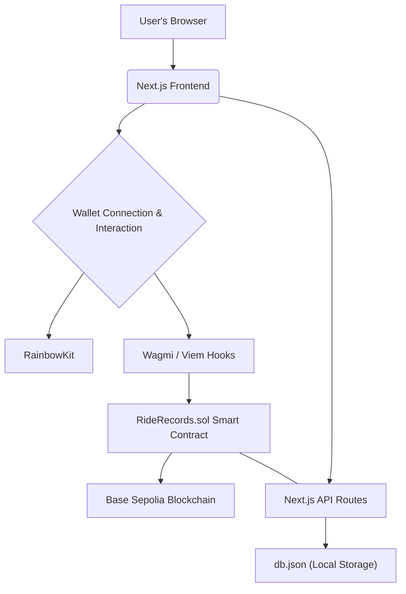

<br />

# 🚗 RideRecords: Decentralized Vehicle History

## 🚀 Overview
**RideRecords** is an innovative decentralized application (dApp) built on the **Scaffold-Lisk** framework, designed to bring transparency and immutability to vehicle history records. Tired of odometer fraud, hidden accident histories, and untraceable ownership transfers? RideRecords leverages blockchain technology to provide a secure, verifiable, and permanent ledger for every vehicle.

Powered by **Next.js**, **Hardhat**, **Wagmi**, **Viem**, and **RainbowKit**, this application demonstrates how a modern web interface can seamlessly interact with smart contracts to manage crucial vehicle data. From registration to ownership transfers and maintenance records, every significant event in a vehicle's life is recorded on-chain, creating a single source of truth accessible to everyone.

## ✨ Key Features

-   **Decentralized Vehicle Registration**: Register new vehicles on the blockchain with essential details, creating an immutable genesis record.
-   **Secure Ownership Transfer**: Facilitate transparent and verifiable vehicle ownership changes, securely recorded on-chain.
-   **Verified Maintenance History**: Owners can add maintenance logs, mileage updates, and other critical events, building a comprehensive service history.
-   **Personalized Vehicle Management**: A "My Vehicles" page allows connected users to view all vehicles they currently own, with quick access to detailed records via an interactive modal.
-   **Intuitive & Responsive UI**: A beautifully crafted user interface, inspired by modern design principles, ensures a smooth and engaging experience across all devices.
-   **Multi-language Support**: Seamlessly switch between English and Spanish for a broader user base.

## 🛠️ Technology Stack

**Smart Contracts & Blockchain Interaction:**
-   **Solidity**: For writing the `RideRecords.sol` smart contract.
-   **Hardhat**: Ethereum development environment for compiling, deploying, and testing smart contracts.
-   **Wagmi & Viem**: React hooks and low-level interfaces for interacting with Ethereum smart contracts and the blockchain.
-   **RainbowKit**: A comprehensive wallet connection library for a seamless user authentication experience.
-   **Base Sepolia**: The target Superchain testnet for contract deployment and interaction.

**Frontend & Backend (Next.js SSR for MVP):**
-   **Next.js (React)**: A powerful React framework for building fast and scalable web applications, handling both client-side rendering and server-side rendering (SSR) for API routes.
-   **Tailwind CSS**: A utility-first CSS framework for rapid and consistent styling.
-   **`db.json` (Local Storage)**: For hackathon MVP purposes, a simple JSON file acts as a local "database" managed via Next.js API routes to store off-chain vehicle details and historical events that complement on-chain data.
-   **`nanoid`**: Used for generating unique IDs for off-chain records.

## 🏗️ Architecture Overview

The RideRecords application follows a hybrid architecture, combining the benefits of decentralized blockchain storage with a performant Next.js frontend.

-   **Frontend**: Built with Next.js, it provides the user interface for interacting with the dApp. It leverages `wagmi` and `scaffold-lisk`'s custom hooks to send transactions and read data from the `RideRecords` smart contract.
-   **Smart Contract (`RideRecords.sol`)**: Deployed on the Base Sepolia testnet, this Solidity contract manages core vehicle ownership and event immutability.
-   **Next.js API Routes (Backend)**: For the hackathon MVP, server-side API routes are implemented in Next.js to handle persistent storage of richer vehicle metadata and detailed event histories in a local `db.json` file. These routes are called after successful on-chain transactions to synchronize off-chain data.



## 📂 Project Structure

-   `packages/hardhat`: Contains the `RideRecords.sol` smart contract, deployment scripts, and Hardhat configuration.
-   `packages/nextjs`: Houses the Next.js frontend application, including pages, components, hooks, styles, and API routes.
    -   `app/`: Next.js App Router pages (e.g., `/`, `/register`, `/my-vehicles`, `/vehicle/[serialHash]`).
    -   `components/`: Reusable React components, including `TopLeftLogo` and `TopRightNavigation`.
    -   `app/api/`: Next.js API routes for interacting with `db.json`.
    -   `db.json`: The local JSON file acting as a mock database.
-   `README.md`: This document.
-   `PRD.md`: The Product Requirements Document outlining the project goals.

## ⚡ Quickstart

Follow these steps to get your RideRecords dApp up and running:

1.  **Clone the repository & install dependencies**:

    ```bash
git clone https://github.com/pauliro/ride-record-lisk.git
cd scaffold-lisk
yarn install
```

2.  **Run a local blockchain network**:
    Open a new terminal and run:

    ```bash
yarn chain
```
    This command starts a local Hardhat development network, essential for deploying and testing your smart contracts.

3.  **Deploy the `RideRecords` smart contract**:
    Open another terminal (while `yarn chain` is still running) and deploy the contract:

    ```bash
yarn deploy
```
    This deploys the `RideRecords.sol` contract to your local network.

4.  **Start the Next.js frontend application**:
    In a third terminal, start the Next.js development server:

    ```bash
yarn start
```
    Your application will be available at `http://localhost:3000`.

## 📖 Usage Instructions

1.  **Connect Your Wallet**: On any page, use the wallet connector in the top-right corner to connect your Ethereum-compatible wallet (e.g., MetaMask, WalletConnect). Ensure you're connected to the **Base Sepolia** network (or your local Hardhat network for development).
2.  **Register a New Vehicle**:
    -   Navigate to the "Register Vehicle" page (accessible via the top-right navigation or the landing page CTA).
    -   Fill in the vehicle details.
    -   Click "Register Vehicle" and confirm the transaction in your wallet.
    -   Upon successful transaction, the vehicle will be registered on-chain, and its initial details will be stored off-chain.
3.  **View Your Vehicles**:
    -   Click "My Vehicles" in the top-right navigation.
    -   You'll see a list of all vehicles currently registered to your connected wallet address.
    -   Click on any vehicle card to open a modal displaying its comprehensive details and history.
4.  **Add Maintenance Records**:
    -   From a vehicle's detail page (accessed via "My Vehicles"), if you are the current owner, you can add maintenance records.
    -   Enter a description and submit.
5.  **Transfer Ownership**:
    -   From a vehicle's detail page, if you are the current owner, you can initiate an ownership transfer.
    -   Enter the recipient's Ethereum address and the current odometer reading.
    -   Confirm the transaction in your wallet.

## ⚙️ Development & Customization

-   **Smart Contract Logic**: Modify `packages/hardhat/contracts/RideRecords.sol` to update contract functionalities.
-   **Frontend UI**: Develop and enhance the user interface in `packages/nextjs/app`, `components`, and `styles`.
-   **Deployment**: Adjust deployment scripts in `packages/hardhat/deploy` for different network configurations.
-   **Local Backend**: Modify Next.js API routes in `packages/nextjs/app/api` to change how off-chain data is handled.

## 🌟 Future Enhancements

-   **IPFS Integration**: Store maintenance evidence and other documents directly on IPFS for true decentralization of all assets.
-   **Advanced Backend**: Migrate `db.json` to a more robust database solution (e.g., PostgreSQL, MongoDB) for production-grade persistent storage and scalability.
-   **Rich Event Types**: Introduce more granular event types (e.g., accident reports, inspection records) with richer metadata.
-   **Notification System**: Implement real-time notifications for vehicle events (e.g., ownership transfer complete, new maintenance added).
-   **Search Functionality**: Implement a global search by VIN, license plate, or serial hash.

## 🙏 Credits

RideRecords is built upon the excellent foundation provided by [Scaffold-Lisk](https://github.com/LiskHQ/scaffold-lisk) (a fork of [Scaffold-ETH2](https://github.com/scaffold-eth/scaffold-eth-2)), a toolkit that greatly simplifies dApp development. Special thanks to the creators and maintainers of these projects and all the underlying technologies (Next.js, Hardhat, Wagmi, RainbowKit, Viem, Tailwind CSS) and of course all mentors.
